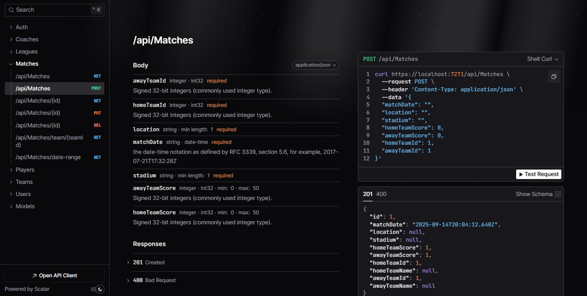
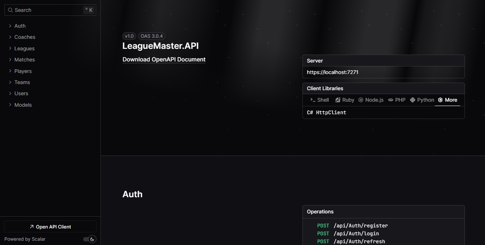
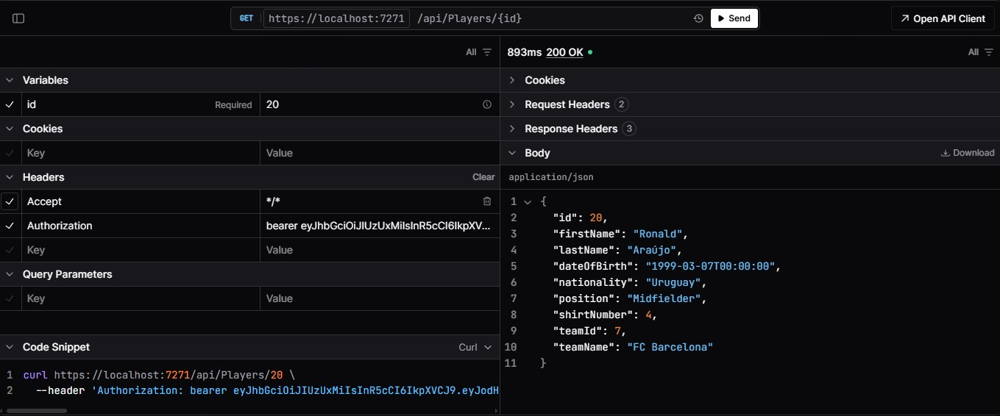
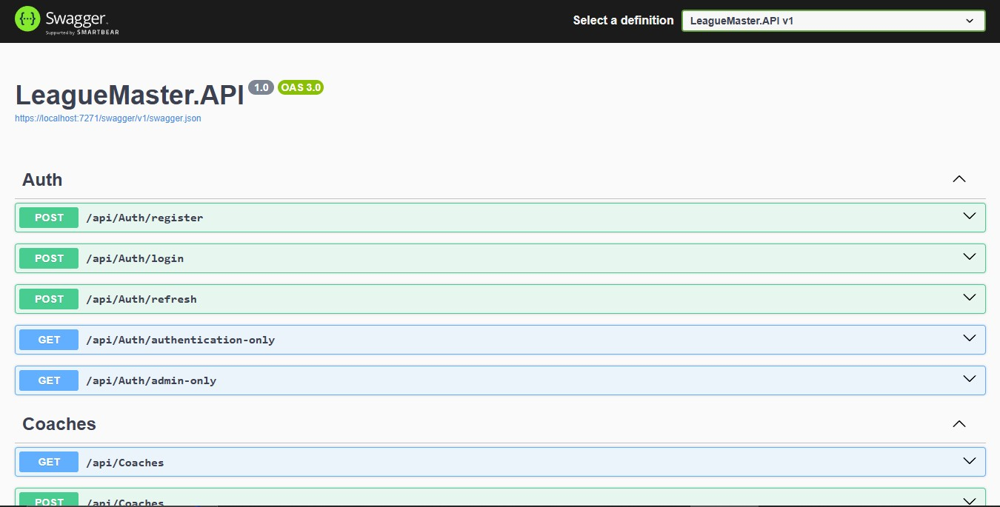

# LeagueMaster

A comprehensive **RESTful Web API** for managing football leagues, teams, players, coaches, and matches. Built with **.NET 9** and following **Clean Architecture** principles with a focus on security, scalability, and maintainability.



## ✨ Features

### Core Functionality

- **League Management** - Create and manage football leagues with seasons
- **Team Management** - Handle team information, stadiums, and league associations
- **Player Management** - Manage player profiles, positions, and team assignments
- **Coach Management** - Track coaching staff and team associations
- **Match Management** - Schedule and record match results between teams

### Security & Authentication

- **JWT Authentication** - Secure token-based authentication system
- **Role-Based Authorization** - User and Admin roles with different permissions
- **Refresh Token Support** - Automatic token renewal for seamless user experience
- **Password Hashing** - Secure password storage using ASP.NET Core Identity

### Technical Features

- **Clean Architecture** - Separation of concerns across Domain, Application, Infrastructure, and API layers
- **Entity Framework Core** - Code-first approach with SQL Server integration
- **AutoMapper** - Automatic object-to-object mapping between entities and DTOs
- **Audit Trail** - Automatic tracking of creation and modification timestamps
- **API Documentation** - Interactive Swagger/OpenAPI documentation with Scalar UI

## 🛠️ Tech Stack

- **.NET 9** - Latest .NET framework
- **C# 13** - Modern C# language features
- **ASP.NET Core Web API** - RESTful API framework
- **Entity Framework Core** - ORM for database operations
- **SQL Server** - Primary database
- **JWT Bearer Authentication** - Security implementation
- **AutoMapper** - Object mapping
- **Swagger/OpenAPI** - API documentation
- **Scalar** - Enhanced API documentation UI

## API Documentation

The API is documented using Swagger/OpenAPI and Scalar, providing an interactive interface for testing endpoints.

Access the API documentation at: `https://localhost:{port}/swagger` or `https://localhost:{port}/scalar`

### Scalar UI





### Swagger UI



## 🏗️ Architecture

The solution follows **Clean Architecture** principles with clear separation of concerns:

```plaintext
LeagueMaster.sln
├─ LeagueMaster.Domain/ # Core business entities and enums
│ ├─ Entities/ # League, Team, Player, Coach, Match, User
│ ├─ Enums/ # PlayerPosition, UserRole
│ └─ BaseDomainObject.cs # Base entity with audit fields
├─ LeagueMaster.Application/ # Business logic and use cases
│ ├─ DTOs/ # Data transfer objects
│ ├─ Interfaces/ # Service and repository abstractions
│ ├─ Services/ # Business logic implementation
│ └─ Mappings/ # AutoMapper profiles
├─ LeagueMaster.Infrastructure/ # Data access and external concerns
│ ├─ Persistence/ # DbContext and configurations
│ ├─ Repositories/ # Data access implementations
│ └─ Migrations/ # EF Core migrations
└─ LeagueMaster.API/ # HTTP layer and configuration
├─ Controllers/ # API endpoints
├─ Program.cs # Application startup
└─ appsettings.json # Configuration
```

## 🔐 Authentication

The API uses JWT authentication with role-based authorization:

### Roles

- **User** - Can view leagues, teams, players, coaches, and matches
- **Admin** - Full CRUD operations on all resources

### Example Authentication Flow

1. **Register** - `POST /api/users/register`
2. **Login** - `POST /api/users/login` (returns access token and refresh token)
3. **Use Token** - Include `Authorization: Bearer {token}` header
4. **Refresh** - `POST /api/users/refresh` when token expires

## 📚 API Endpoints

### Authentication

- `POST /api/users/register` - Register new user
- `POST /api/users/login` - User login
- `POST /api/users/refresh` - Refresh access token

### Leagues

- `GET /api/leagues` - Get all leagues (User/Admin)
- `GET /api/leagues/{id}` - Get league by ID (User/Admin)
- `POST /api/leagues` - Create league (Admin only)
- `PUT /api/leagues/{id}` - Update league (Admin only)
- `DELETE /api/leagues/{id}` - Delete league (Admin only)

### Teams, Players, Coaches, Matches

Similar CRUD patterns with appropriate role restrictions.

## 🧪 Testing

Test the API using the provided HTTP file:

- `LeagueMaster.API/LeagueMaster.API.http` - Sample requests for all endpoints

## 🗃️ Database Schema

The database includes the following main entities:

- **Leagues** - Competition information
- **Teams** - Team details and league associations
- **Players** - Player profiles with team assignments
- **Coaches** - Coaching staff information
- **Matches** - Game results between teams
- **Users** - Authentication and authorization

All entities inherit from `BaseDomainObject` providing automatic audit trails.


